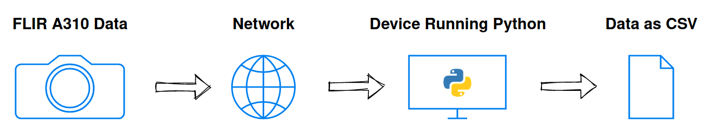

 # What is it:
 
 Log temperature data from [FLIR A310](https://www.flir.com/products/a310/) IR camera(s) to a CSV file(s) using Python.
 
 
 
 # How to use it:
 1. Get the IP address of each camera on the network.
 2. In `flir_a310_log_data_via_modbus.py`:
 	* Adjust the `csv_header` list for the number of cameras.
 	* Adjust the `ip_list` list to match the number and addresses of cameras.
 	* Set the `reg` variable for desired data object in the camera.
		* See [matrix of registers](Convert_EthernetIP_to_Modbus_TCP.pdf) published by FLIR.
3. Run `flir_a310_log_data_via_modbus.py` on a device that can connect to the cameras.

# Results:
I have tested this with four cameras and a one second log interval in an industrial setting with great success.

# Notes:
* The A310 only appears to update these registers several times per second.
* This may work with other FLIR cameras that can connect to a network via ethernet, but I haven't tried it.

# Credits:
Many thanks to **sourceperl** for the [pyModbusTCP](https://github.com/sourceperl/pyModbusTCP) Python library.
